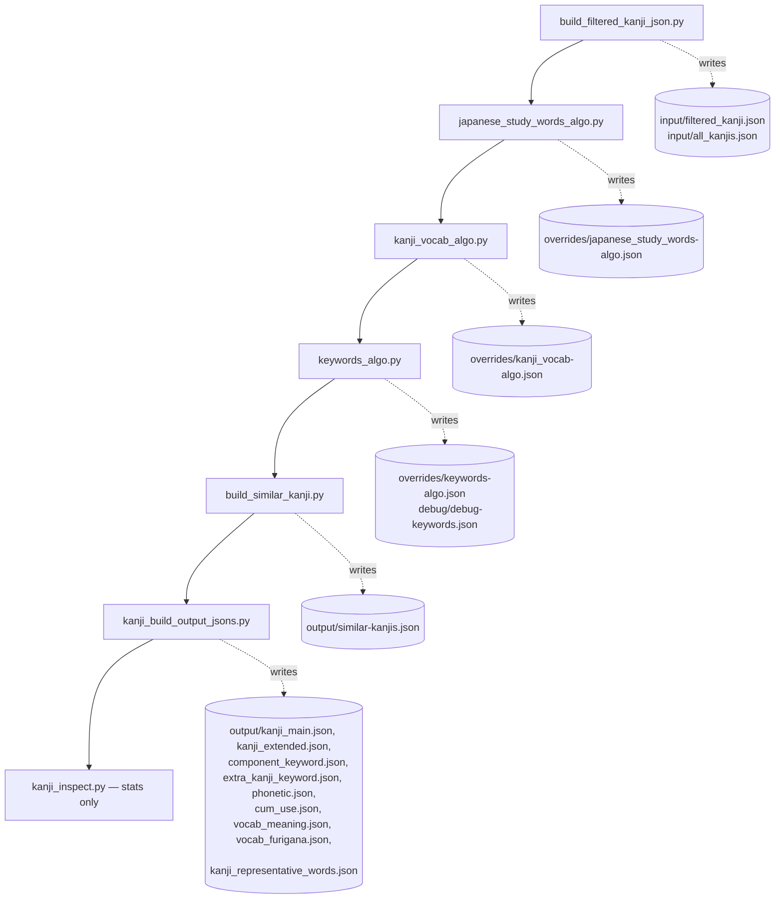
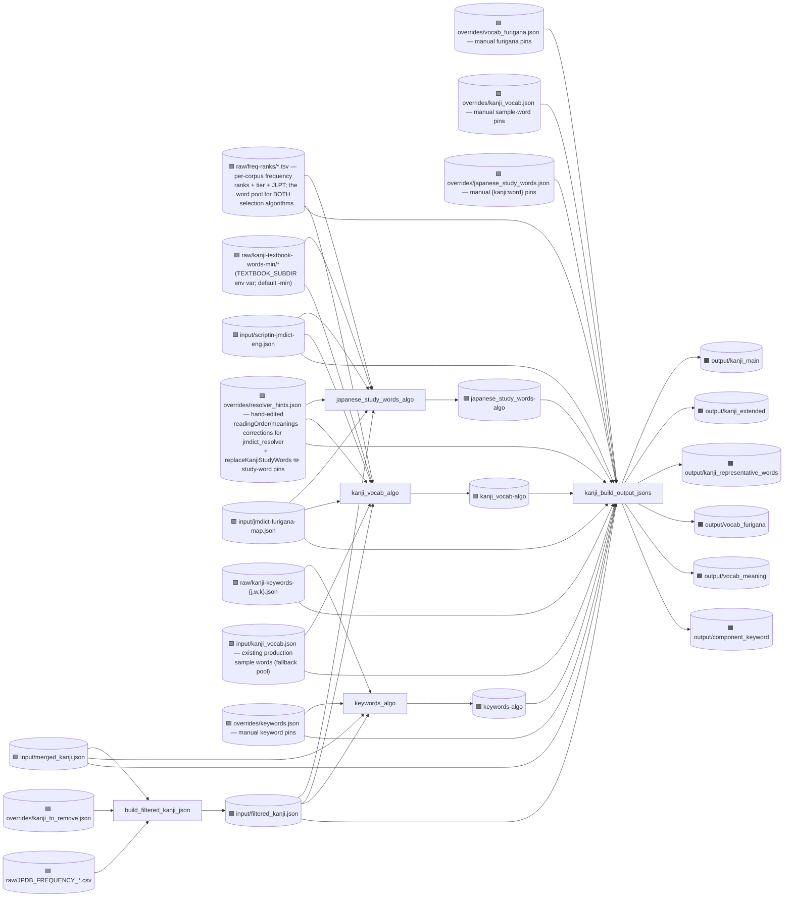
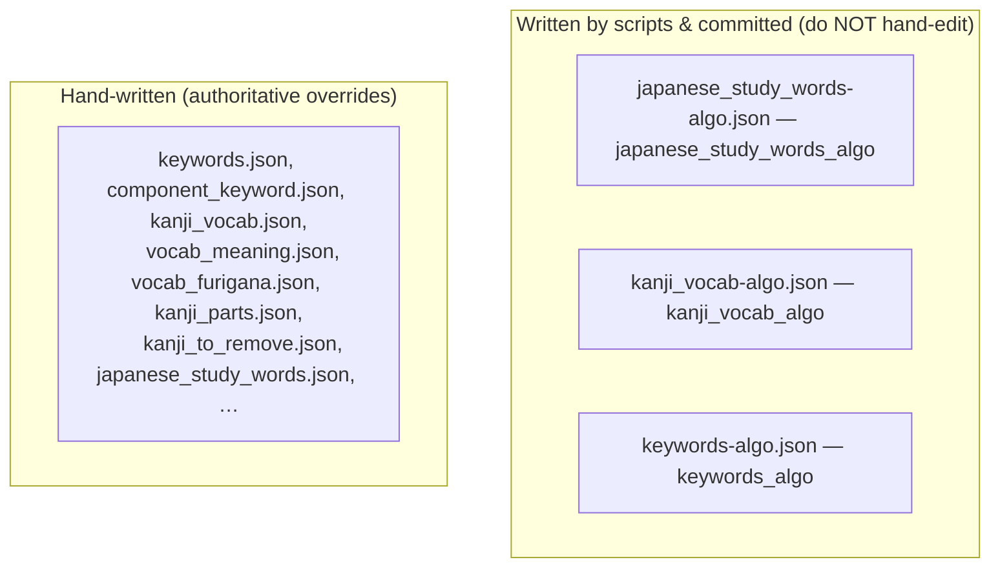
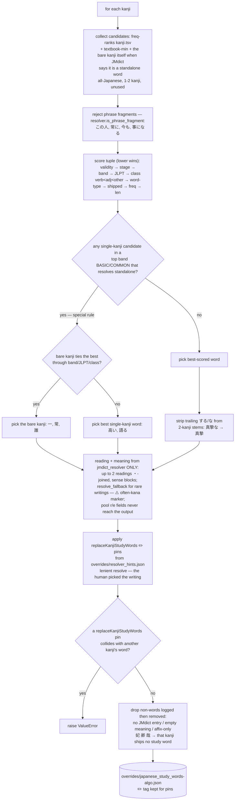
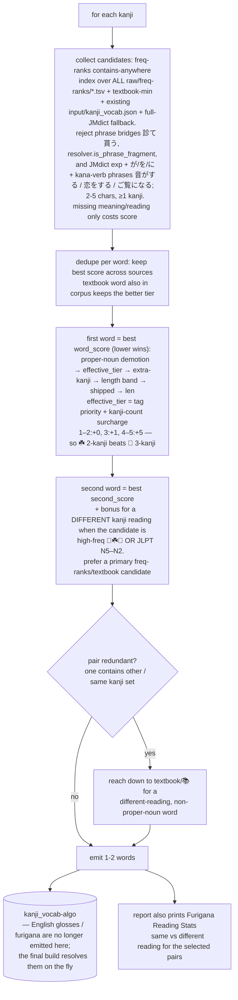
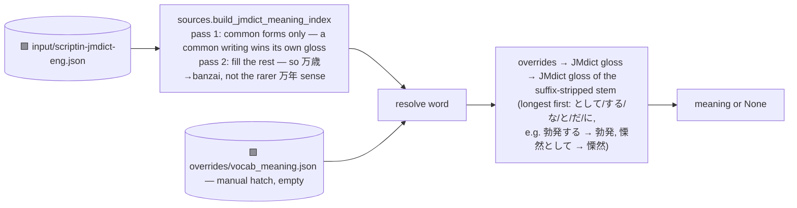
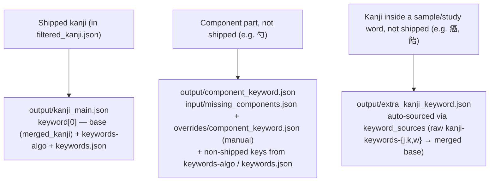

# Kanji-heatmap-data build flowcharts

Visual map of how `src/*.py` turns raw sources into the shipped `output/` JSONs.
This is a snapshot of the current pipeline.

Legend:
- 🟩 raw input (hand-authored or third-party, in `raw/` or `input/`)
- 🟦 intermediate override (`overrides/`)
- 🟧 final shipped artifact (`output/`)
- ⬜ script

`input/` is mostly externally maintained and git-ignored. The one exception is
`build_filtered_kanji_json.py`, the first pipeline step, which WRITES
`input/filtered_kanji.json` and `input/all_kanjis.json` there (the canonical
"which kanji ship" list every later step reads); everything else in `input/` is
read-only third-party data. (Nothing in this repo reads `all_kanjis.json` — it is
emitted for downstream/frontend consumers.)

Each committed `*_algo.py` generator is named after the `-algo.json` file it writes
(`kanji_vocab_algo.py` → `kanji_vocab-algo.json`). `japanese_study_words_algo.py`
and `kanji_vocab_algo.py` are **pure**: they never read their hand-written override
counterpart, so those manual overrides are merged on top at build time by
`kanji_build_output_jsons.py` (see §3, §4). `keywords_algo.py` is the **exception**:
it reads `overrides/keywords.json` both to reserve those keywords (so no other kanji
is assigned one) AND to copy the manual value straight into its own `keywords-algo.json`
output — so ~26 of the committed algo entries are actually manual values. The build's
`load_keywords_override` merges `keywords.json` over the algo layer again regardless,
so shipped output is unaffected, but the `-algo` file is not purely algorithmic.
Furigana and meanings are generated on the fly in the final build (no intermediate
cache files) — only hand pins in `overrides/vocab_furigana.json` /
`overrides/vocab_meaning.json` win over the generated layer.

---

## 1. The orchestrated pipeline (`generate.sh`, top to bottom)

The full build is offline and deterministic. Each step writes files the next reads.



After G, `generate.sh` copies `input/filtered_kanji.json` to
`output/filtered_kanji.json` (a shipped release file — see `constants.output_files`);
it is not written by any script.

Furigana is generated inside the final build (`dump_all_vocab_furigana` →
`generate_furigana_algo.build_furigana_for_words`): furigana map + reading hints
(freq-ranks / JMdict) + alignment fallback. Hand-written
`overrides/vocab_furigana.json` wins; the build aborts if a word is still bare
`[[word]]` or missing. Meanings follow the same pattern (JMdict on the fly +
`overrides/vocab_meaning.json`).

`kanji_build_output_jsons.py` is the single hard gate. It raises loudly on:
- a shipped sample word with no resolvable meaning (`dump_all_vocab_meanings`) or no
  reading (`dump_all_vocab_furigana`);
- two kanji sharing a keyword (`assert_unique_keywords`);
- two kanji sharing a representative study word, or a study word missing its
  reading/gloss (`dump_kanji_representative_words`).

---

## 2. Full data-dependency graph



For readability, S6's many auxiliary single-purpose inputs are NOT drawn above:
`input/missing_components.json`, `input/phonetic_components.json`,
`input/cum_use.json`, `raw/JITEN_FREQUENCY.csv`, `raw/JPDB_FREQUENCY_*.csv`,
`raw/KKLC-ORDER.txt`, `raw/order.csv`, `overrides/kanji_parts.json`,
`overrides/component_keyword.json`, and `overrides/vocab_meaning.json`. The graph
above shows the word / keyword / furigana / meaning flow; those feed straight into
the reformatted kanji fields (strokes, frequency ranks, decomposition, etc.).

Note: unlike the earlier design, the study-word algo (S2) no longer reads
`overrides/japanese_study_words.json` — that manual pin file is merged at build time by
S6 (`kanji_load.dump_kanji_representative_words`), the same pattern as
`overrides/kanji_vocab.json` for sample words. `overrides/resolver_hints.json`'s
`replaceKanjiStudyWords` pins are the exception: they still live inside S2 (a resolver
hint, not the `-algo` counterpart).

---

## 3. Override files: algorithm-generated vs hand-written

Files in `overrides/` come from two sources. Only these are written by scripts and
committed — all have the `-algo` suffix. Every other `overrides/*` file is
hand-maintained and must not be regenerated. Furigana and meanings have no `-algo`
cache; they are generated inside the final build.



At build time the final build prefers manual overrides over the algo layers. The
`japanese_study_words_algo` and `kanji_vocab_algo` generators are pure — they never
read their manual counterpart, so the merge (and its collision/completeness checks)
all live in `kanji_build_output_jsons.py`. `keywords_algo` is the exception: it reads
`overrides/keywords.json` to reserve those keywords AND copies each manual value into
its own `keywords-algo.json` (so the committed algo file embeds ~26 manual values).
The build merges `keywords.json` on top again, so shipped output is unaffected.

---

## 4. The two selection algorithms (per-kanji logic)

### `japanese_study_words_algo.py`
One unique study word per kanji; the word must START with the kanji
(textbook words merely CONTAINING it ride along with a stage penalty).



Then the manual `{kanji: word}` pins in `overrides/japanese_study_words.json` are merged
onto that `-algo` output at BUILD time (`kanji_load.dump_kanji_representative_words`,
called by `kanji_build_output_jsons.py`):

```mermaid
flowchart TD
    A[(japanese_study_words-algo.json
    — includes replaceKanjiStudyWords picks)] --> M[merge manual pins:
    overrides/japanese_study_words.json {kanji:word} WINS]
    P[(overrides/japanese_study_words.json)] --> M
    M --> DER[derive each pin's reading + meaning via
    japanese_study_words_algo.resolve_manual_pin_entries
    same resolver the algo uses]
    DER --> DUP{two kanji share a word?}
    DUP -- yes --> ERR1[raise ValueError]
    DUP -- no --> MISS{any shipped word missing
    reading or english gloss?}
    MISS -- yes --> ERR2[raise ValueError]
    MISS -- no --> BADGE[replace ✏️ with the word's REAL
    frequency badge frequency_tag — logs/-algo keep ✏️]
    BADGE --> OUT[(output/kanji_representative_words.json)]
```

### `kanji_vocab_algo.py`
Up to two SAMPLE words per kanji (kanji can appear anywhere), with reading diversity.



Hand-curated sample picks in `overrides/kanji_vocab.json` win at BUILD time
(`build_helpers.get_words`: manual → `kanji_vocab-algo` → `input/kanji_vocab.json`),
not inside the algo.

Readings/meanings for the STUDY words come from `src/jmdict_resolver.py` (JMdict only —
pool reading/meaning fields never reach the output). Per-word hand corrections for the
resolver (leading reading, replacement meaning) and the `replaceKanjiStudyWords` ✏️
study-word pins live in `overrides/resolver_hints.json`, not in code.

---

## 5. Word-meaning resolution

Every English gloss comes from **one source: JMdict** (`input/scriptin-jmdict-eng.json`).
`kanji_load.make_meaning_resolver` builds a `{form: gloss}` index once
(`sources.build_jmdict_meaning_index`, the same appliesToKanji-aware gloss the
sample-vocab algo uses) and returns a `resolve(word)` closure:



Two passes because the index is keyed by surface writing, and a writing can be shared
by several JMdict entries: pass 1 lets a form that is itself common claim its common
gloss before any rarer homograph, regardless of file order.

The final build is the single hard gate: `dump_all_vocab_meanings` RAISES if any
shipped word resolves to no meaning (add it to `overrides/vocab_meaning.json`), and
`dump_all_vocab_furigana` RAISES if any has no reading (bare `[[word]]`; add it to
`overrides/vocab_furigana.json`). Because of this, the sample-vocab algorithm does
NOT pre-filter candidates by meaning/reading availability — a missing one only
costs score, so eligibility can never drift from what the build actually resolves.

---

## 6. Where a kanji's keyword comes from

A kanji can need a keyword in three situations, each with its own output file:



Kanji that appear only inside vocabulary words but aren't in `merged_kanji.json` at all
(e.g. 癌, 飴, 葱) get a keyword from `extra_kanji_keyword.json` when the raw keyword
files have one; the rest (very rare) are left unlabeled. Two kanji must never share a
keyword — `assert_unique_keywords` fails the build if they do.

---

## 7. Similar-kanji neighbors (`build_similar_kanji.py`)

`output/similar-kanjis.json` is generated (not static): for each shipped kanji, its
most-similar shipped kanji, most-similar first (at most 10; lists may be shorter).
Kanji covered by `raw/similarity/dkanjistat.json` use Kanjistat optimal-transport
distance, gated by a distance ceiling and stroke-count delta; the rest fall back
to the kanjidict phonetic / radical+IDS heuristic.
