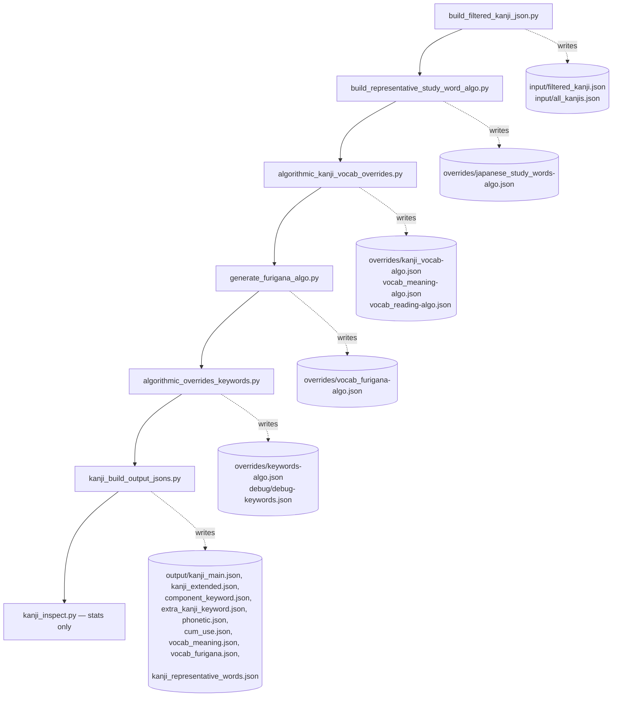
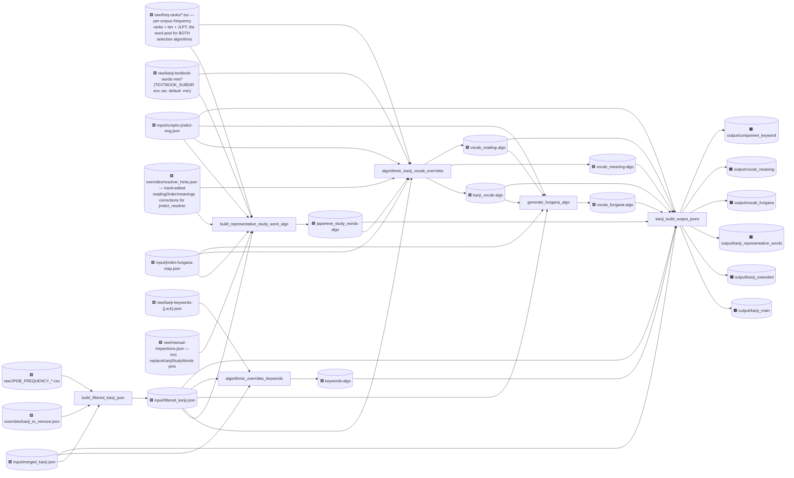
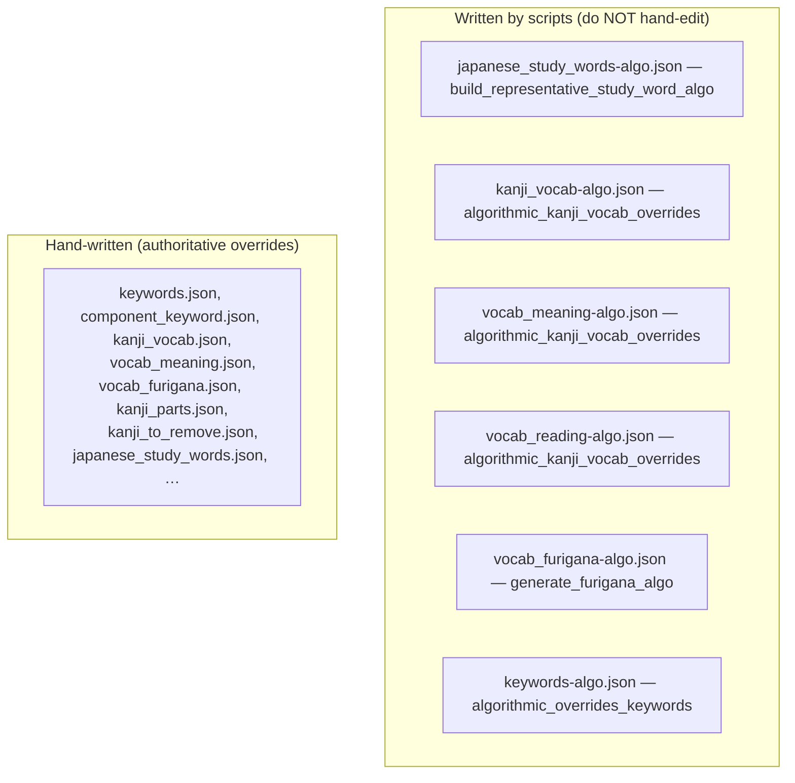
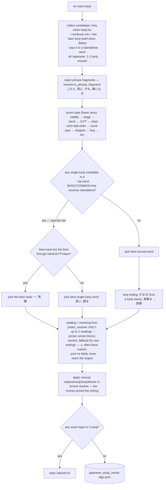
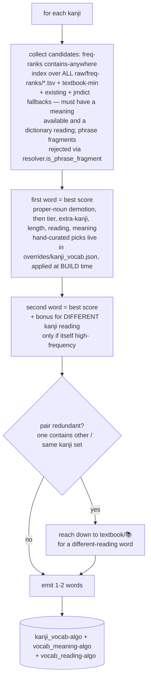
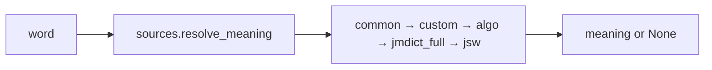
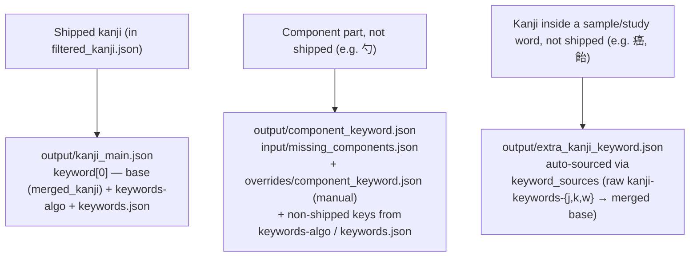

# Kanji-heatmap-data build flowcharts

Visual map of how `src/*.py` turns raw sources into the shipped `output/` JSONs.
This is a snapshot of the current pipeline.

Legend:
- 🟩 raw input (hand-authored or third-party, in `raw/` or `input/`)
- 🟦 intermediate override (`overrides/`)
- 🟧 final shipped artifact (`output/`)
- ⬜ script

`input/` is externally maintained and git-ignored; the build only reads from it.

---

## 1. The orchestrated pipeline (`generate.sh`, top to bottom)

The full build is offline and deterministic. Each step writes files the next reads.

`output/similar-kanjis.json` is a static artifact: its generator
(`build_similar_kanjis.py`) has been removed from the repo, but the file still ships
in the release tarball (listed in `constants.output_files`).

`generate_furigana_algo.py` is the ONLY step that generates furigana. It computes the
shipped word set itself (same `get_words` logic as the final build) and covers EVERY
shipped word — like all `-algo` files it is complete and never consults the manual
overrides. The final build then just merges the two layers (hand-written
`overrides/vocab_furigana.json` wins) and aborts if a word is in neither.

---

## 2. Full data-dependency graph

---

## 3. Override files: algorithm-generated vs hand-written

Files in `overrides/` come from two sources. Only these are written by scripts — all
have the `-algo` suffix. Every other `overrides/*` file is hand-maintained and must
not be regenerated.

At build time the final build prefers manual overrides over the `-algo` files.

---

## 4. The two selection algorithms (per-kanji logic)

### `build_representative_study_word_algo.py`
One unique study word per kanji; the word must START with the kanji
(textbook words merely CONTAINING it ride along with a stage penalty).

### `algorithmic_kanji_vocab_overrides.py`
Up to two SAMPLE words per kanji (kanji can appear anywhere), with reading diversity.

Readings and meanings for the STUDY words come from `src/jmdict_resolver.py`
(JMdict only — pool reading/meaning fields never reach the output). Per-word
hand corrections for the resolver (leading reading, replacement meaning) live in
`overrides/resolver_hints.json`, not in code.

---

## 5. Word-meaning resolution

A word's English meaning is resolved by one shared function,
`sources.resolve_meaning(word, ...)`, used by the sample-vocab algorithm and the
final build. Callers pass whichever source maps they have; the precedence is fixed
in the function:

The final build falls back to the word itself when every source misses, and prints
each such word in a "Word meaning Not Found" report — hand-add those to
`overrides/vocab_meaning.json`.

---

## 6. Where a kanji's keyword comes from

A kanji can need a keyword in three situations, each with its own output file:

Kanji that appear only inside vocabulary words but aren't in `merged_kanji.json` at all
(e.g. 癌, 飴, 葱) get a keyword from `extra_kanji_keyword.json` when the raw keyword
files have one; the rest (very rare) are left unlabeled.

